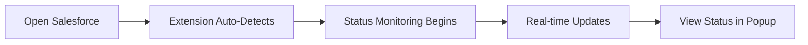

# 🔍 Salesforce Status Monitor Chrome Extension

<div align="center">


**Real-time Salesforce user status monitoring for Talabat support teams**

[Installation](#-installation) • [Features](#-features) • [Usage](#-usage) • [Documentation](#-documentation)

</div>

---

## 📋 Overview

The Salesforce Status Monitor is a sophisticated Chrome extension designed specifically for Talabat support team members. It provides real-time monitoring of Salesforce user status using advanced network analysis techniques, eliminating the need for unreliable DOM-based detection methods.

### 🎯 Key Highlights

- **🔄 Real-time Status Detection** - Network-based monitoring using Performance Observer API
- **🔐 Secure Authentication** - @talabat.com email restriction with encrypted backend
- **📊 Comprehensive Tracking** - Status history and team analytics
- **🚀 Background Monitoring** - Works across multiple Salesforce tabs automatically
- **⚡ Performance Optimized** - Minimal resource usage with efficient request filtering

---

## ✨ Features

### 🛡️ Advanced Monitoring System
- **Network Request Analysis** - Monitors XMLHttpRequest and Fetch API calls
- **Performance Observer Integration** - Real-time detection without DOM dependencies  
- **Multi-tab Support** - Automatic monitoring across all Salesforce instances
- **Status History Tracking** - Complete audit trail of status changes

### 🔒 Security & Authentication
- **Domain Restriction** - Limited to @talabat.com email addresses
- **Encrypted Communication** - Secure HTTPS backend integration
- **Password Protection** - SHA-256 hashing with minimum security requirements
- **Session Management** - Persistent authentication across browser sessions

### 📱 User Interface
- **Clean Popup Interface** - Intuitive login and status display
- **Real-time Updates** - 5-second refresh intervals
- **Active Tab Management** - Visual display of monitored Salesforce tabs
- **Status Indicators** - Color-coded status display with timestamps

### 📈 Status Detection
Automatically detects and categorizes these Salesforce statuses:

| Status ID | Description |
|-----------|-------------|
| `0N51r0000004CAy` | **Online for Cases** - Available for customer support |
| `0N51r0000004CB8` | **Short Break (personal)** - Personal break time |
| `0N51r0000004CBI` | **Training / QA / Meeting** - Learning activities |
| `0N569000000oLnA` | **One to One** - Individual meetings |
| `0N51r0000004CBD` | **Lunch/Dinner** - Meal breaks |
| `0N51r000000CbLR` | **Calls Only** - Available for calls only |
| `0N51r0000004CBS` | **Assigned Task - Non-SF** - External tasks |
| `0N51r0000004CBN` | **Assigned Task - Non-Omni** - Non-Omni tasks |
| `0N569000000oLn9` | **Assigned Task** - General task assignment |

---

## 🚀 Installation

### Prerequisites
- Google Chrome 88+ with Extensions enabled
- Access to Salesforce with valid credentials
- @talabat.com email address for authentication

### Step 1: Extension Setup

```bash
# Clone the repository
git clone https://github.com/mohammed0taku/Salesforce-Status-Tracking-System.git
cd salesforce-status-monitor

# Or download and extract the ZIP file
```

1. Open Chrome and navigate to `chrome://extensions/`
2. Enable **Developer mode** (top-right toggle)
3. Click **"Load unpacked"** and select the extension folder
4. Verify the extension appears in your toolbar

### Step 2: Backend Configuration

<details>
<summary>🔧 Google Apps Script Setup</summary>

1. Go to [Google Apps Script](https://script.google.com/)
2. Create a **New Project**
3. Replace default code with contents from `backend_code.gs`
4. Click **Deploy** → **New deployment**
5. Set type: **Web app**
6. Configure permissions:
   - Execute as: **Me**
   - Who has access: **Anyone**
7. **Copy the deployment URL**

</details>

### Step 3: Configuration

1. Open `config.json` in the extension folder
2. Replace `YOUR_GOOGLE_APPS_SCRIPT_URL_HERE` with your deployment URL:

```json
{
    "backendUrl": "https://script.google.com/macros/s/YOUR_SCRIPT_ID/exec",
    "debug": false,
    "refreshInterval": 5000
}
```

3. Reload the extension in Chrome

---

## 📖 Usage

### Initial Setup

1. **Click the extension icon** in your Chrome toolbar
2. **Register your account:**
   - Enter your @talabat.com email address
   - Create a secure password (8+ characters)
   - Click **"Register"**
3. **Login** with your credentials

### Daily Operation

<div align="center">



</div>

1. **Open Salesforce** in any Chrome tab
2. **Extension automatically starts monitoring** your status
3. **Status changes are detected** via network requests
4. **View current status** by clicking the extension icon
5. **Status history** is automatically saved and synced

### Monitoring Dashboard

The popup interface provides:
- **Current Status** with color-coded indicators
- **Last Update** timestamp
- **Active Salesforce Tabs** list
- **Auto-refresh** countdown timer

---

## 🏗️ Technical Architecture

### System Overview

```
┌─────────────────┐    ┌──────────────────┐    ┌─────────────────────┐
│   Content       │    │    Background    │    │   Google Apps       │
│   Script        │◄──►│    Service       │◄──►│   Script Backend    │
│                 │    │    Worker        │    │                     │
└─────────────────┘    └──────────────────┘    └─────────────────────┘
         │                       │                         │
         ▼                       ▼                         ▼
┌─────────────────┐    ┌──────────────────┐    ┌─────────────────────┐
│  Salesforce     │    │   Chrome APIs    │    │   Google Sheets     │
│  Network APIs   │    │   (Storage/Tabs) │    │   Database          │
└─────────────────┘    └──────────────────┘    └─────────────────────┘
```

### Core Components

- **📜 Content Script** (`content_script.js`) - Network monitoring and status detection
- **⚙️ Background Worker** (`background.js`) - Extension lifecycle and tab management  
- **🖥️ Popup Interface** (`popup/`) - User interaction and status display
- **☁️ Backend API** (`backend_code.gs`) - Authentication and data persistence

### Detection Algorithm

```javascript
// Simplified detection flow
Performance Observer → Network Request → Status Analysis → Backend Sync
```

The extension monitors specific Salesforce API endpoints:
- **Messages API** (`Messages?ack=`) - Active session detection
- **Presence API** (`PresenceLogin`, `PresenceStatus`) - Status ID extraction

---

## 🛠️ Development

### Project Structure

```
salesforce-status-monitor/
├── 📄 manifest.json              # Extension manifest
├── 🔧 background.js              # Background service worker
├── 📊 content_script.js          # Main monitoring logic
├── 📁 popup/
│   ├── 🎨 popup.html            # User interface
│   └── ⚡ popup.js              # Interface logic
├── ⚙️ config.json               # Configuration
├── ☁️ backend_code.gs           # Google Apps Script
├── 🖼️ icons/                    # Extension icons
└── 📚 README.md                 # Documentation
```

### Development Setup

```bash
# Enable debug mode
# Set DEBUG = true in all JavaScript files

# Monitor console logs
# Background: chrome://extensions/ → Inspect views
# Content: F12 Developer Tools → Console
# Popup: Right-click extension icon → Inspect popup
```

### Adding New Features

<details>
<summary>🔧 Extending Status Detection</summary>

1. **Update Status Mapping** in `content_script.js`:
```javascript
const STATUS_MAPPING = {
    'NEW_STATUS_ID': 'New Status Description',
    // ... existing mappings
};
```

2. **Add Detection Logic** for new API endpoints
3. **Test with Salesforce** status changes
4. **Update Documentation** and status table

</details>

---

## 🐛 Troubleshooting

### Common Issues

| Issue | Solution |
|-------|----------|
| 🚫 Extension not loading | Check Chrome version (88+) and enable Developer mode |
| 🔐 Authentication failed | Verify @talabat.com email and backend URL configuration |
| 📊 Status not detected | Refresh Salesforce page and check console for errors |
| 🌐 Network errors | Verify Google Apps Script deployment and CORS settings |

### Debug Steps

1. **Check Extension Console:**
   - Go to `chrome://extensions/`
   - Find "Salesforce Status Monitor"
   - Click "Inspect views: background page"

2. **Monitor Network Requests:**
   - Open Salesforce tab
   - Press F12 → Network tab
   - Look for `Messages?ack=` and `Presence` requests

3. **Review Logs:**
   ```javascript
   // All logs are prefixed with [SFF-*]
   [SFF-INFO] Status changed: Online for Cases
   [SFF-WARN] Network request timeout
   [SFF-ERROR] Authentication failed
   ```

---

## 📊 Performance

### Resource Usage
- **Memory**: < 5MB average
- **CPU**: Minimal impact during monitoring
- **Network**: Passive request observation only
- **Storage**: < 1MB for status history

### Optimization Features
- Efficient request filtering
- Limited history retention (100 entries)
- Background script keep-alive system
- Minimal DOM interaction

---

## 🔒 Security

### Data Protection
- ✅ **No sensitive data storage** in browser
- ✅ **Encrypted backend communication** 
- ✅ **Password hashing** with SHA-256
- ✅ **Domain restriction** enforcement
- ✅ **CORS protection** on backend

### Privacy
- 📝 Only status changes are recorded
- 🚫 No personal browsing data collected
- ⏰ Status history limited to work hours
- 🗑️ Automatic cleanup of old data

---

## 🤝 Contributing

### Development Guidelines

```bash
# Fork the repository
git fork https://github.com/mohammed0taku/Salesforce-Status-Tracking-System

# Create feature branch
git checkout -b feature/new-status-detection

# Make changes and test thoroughly
# Commit with clear messages
git commit -m "feat: add new status detection for XYZ"

# Submit pull request with detailed description
```

### Code Standards
- **ES6+** JavaScript syntax
- **Meaningful variable names** and comments
- **Error handling** for all async operations
- **Debug logging** with appropriate levels
- **Security-first** approach for all features

---

<div align="center">

**Built with ❤️**

[⬆️ Back to Top](#-salesforce-status-monitor-chrome-extension)

</div>
